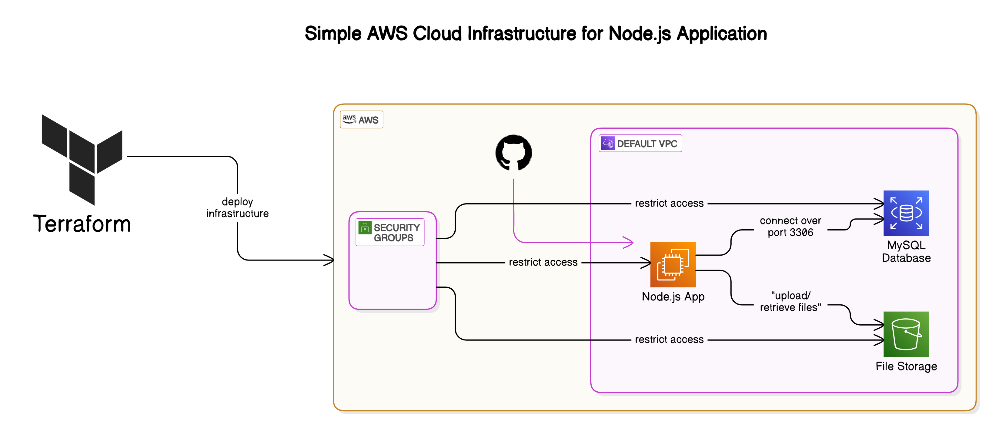

# Terraform 🚀

This repository contains all the source code, examples, and resources for the **Terraform Crash Course For Absolute Beginners**. Learn how to automate your infrastructure using Terraform, an open-source Infrastructure as Code (IaC) tool.

# Introduction to Infrastructure as Code (IaC)

Infrastructure as Code (IaC) is a method of managing and provisioning computing infrastructure using code instead of manual processes. It allows you to define, deploy, and manage infrastructure in a repeatable and consistent way. Terraform is one of the most popular IaC tools, helping automate cloud infrastructure provisioning.

## Example

Instead of manually creating an AWS EC2 instance via the AWS console, you can define it in a Terraform configuration file and apply it to create the instance.

---

# IaC with Terraform

Terraform is an open-source IaC tool that enables you to define and provision infrastructure using a declarative language called **HCL (HashiCorp Configuration Language)**. It supports multiple cloud providers like AWS, Azure, and Google Cloud.

## Example

A simple Terraform configuration to create an AWS EC2 instance:

```hcl
provider "aws" {
  region = "us-east-1"
}

resource "aws_instance" "example" {
  ami           = "ami-12345678"
  instance_type = "t2.micro"
}
```

Run the following commands to apply this configuration:

```sh
terraform init   # Initialize Terraform
terraform apply  # Create the EC2 instance
```

---

# Providers

Providers in Terraform are plugins that allow it to interact with different cloud platforms and services. Each provider (AWS, Azure, GCP) must be configured before using its resources.

## Example

Using the AWS provider:

```hcl
provider "aws" {
  region = "us-west-2"
}
```

---

# Resources

A **resource** in Terraform is a piece of infrastructure, such as a virtual machine, database, or network.

## Example

Creating an S3 bucket in AWS:

```hcl
resource "aws_s3_bucket" "my_bucket" {
  bucket = "my-terraform-bucket"
  acl    = "private"
}
```

---

# Terraform State

Terraform maintains a **state file** (`terraform.tfstate`) that keeps track of the infrastructure it manages. This state file helps Terraform understand the current infrastructure configuration.

## Example

After running `terraform apply`, Terraform creates a `.tfstate` file that stores the information about the created resources.

---

# Variables and Outputs

- **Variables** allow you to parameterize configurations for flexibility.
- **Outputs** display important values after resource creation.

## Example

Using variables:

```hcl
variable "instance_type" {
  default = "t2.micro"
}

resource "aws_instance" "example" {
  ami           = "ami-12345678"
  instance_type = var.instance_type
}
```

## Example

Defining outputs:

```hcl
output "instance_id" {
  value = aws_instance.example.id
}
```

After `terraform apply`, you can see the instance ID:

```sh
Outputs:
instance_id = "i-0abcd1234"
```

---

# Terraform Modules

Modules in Terraform are reusable, self-contained components that help organize infrastructure code.

## Example

Creating a reusable module for an EC2 instance:

### Folder structure:

```
/modules/ec2/
  - main.tf
  - variables.tf
  - outputs.tf
```

### `main.tf`

```hcl
resource "aws_instance" "example" {
  ami           = var.ami
  instance_type = var.instance_type
}
```

### `variables.tf`

```hcl
variable "ami" {}
variable "instance_type" {}
```

### `outputs.tf`

```hcl
output "instance_id" {
  value = aws_instance.example.id
}
```

Using the module in the main configuration:

```hcl
module "ec2" {
  source         = "./modules/ec2"
  ami           = "ami-12345678"
  instance_type = "t2.micro"
}
```

---



# Simple Cloud Infrastructure with AWS and Terraform

## Overview

This project sets up a simple cloud infrastructure using AWS and Terraform to deploy a Node.js application with a MySQL database. The infrastructure is designed to be scalable and secure, leveraging AWS services like EC2, S3, RDS, and VPC.

## Architecture Flow

- GitHub hosts the Node.js application's code.
- Terraform provisions the AWS infrastructure, including:
  - **EC2 instance** to run the Node.js application.
  - **RDS MySQL database** for data storage.
  - **S3 bucket** for file storage.
- The Node.js application connects to the RDS database over port 3306, restricted by security groups for secure communication.
- The application interacts with Amazon S3 for uploading or retrieving files.
- The whole setup runs within the default VPC, ensuring isolation and secure access to resources.
